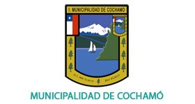

# Ingeniero Civil Matemático

## Educación 

-  Ingenieria Civil Matemática | Universidad Técnica Federico Santa María (Marzo 2024)  

## Habilidades

- Visualización de Datos: Microsoft Power BI, Excel, Power Query.
- Software: Paraview, Softland.
- Lenguajes de Programación: Python, SQL, C++.
- Librerías: FeniCS, VTK, Scikit-Learn, Pandas, NumPy.

## Proyectos

### Permisos de Ciculación Dashboard, Municipalidad de Cochamó

Link del proyecto: [Dashboard Project](https://github.com/JavierValladaresCo/Cochamo_PowerBI).

El propósito de este proyecto es presentar insights importantes utilizando el conjunto de datos de permisos de circulación de la municipalidad de Cochamó, obtenidos de la página [datos.org](https://datos.gob.cl/). En este proyecto, se utilizó Microsoft Power BI para construir visualizaciones con los datos recopilados, además, se crearon diferentes medidas personalizadas utilizando el lenguaje DAX. Por otro lado, se realizó la limpieza y validación de los datos, eliminando cualquier dato vacío y estandarizando el formato de los datos de texto presentes en el dataset.

### Heart Disease Classification

Link del proyecto: [Heart Disease Classification](https://github.com/JavierValladaresCo/Heart_Disease_Classification).

El propósito de este proyecto es construir un modelo de aprendizaje automático para predecir la presencia o ausencia de enfermedad cardíaca, a partir del conjunto de datos obtenido en [Kaggle](https://www.kaggle.com/datasets/mexwell/heart-disease-dataset/data), basado en 11 características diferentes relacionadas con parámetros médicos. Aplicando técnicas de preprocesado de datos, además, de sustitución de parámetros.

